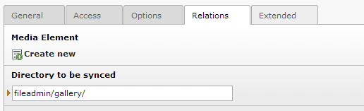
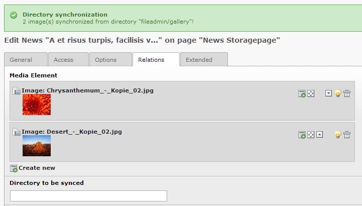

.. ==================================================
.. FOR YOUR INFORMATION
.. --------------------------------------------------
.. -*- coding: utf-8 -*- with BOM.

=============================================================
Newssdirsync: Synchronize an image folder with media records
=============================================================

This extension provides an easy way to add multiple images to a news record of EXT:news by providing the path to a folder.
During saving the news record all images will be added as media element.

To avoid duplicates images are not added if those are either already existing as media element or are a duplicate of another file in the given directory.

Screenshots
^^^^^^^^^^^^^^^^

(`If not being displayed, click here <https://raw.github.com/cyberhouse/t3ext-newsdirsync/master/Resources/Public/Images/screenshot-1.png>`_)

		
(`If not being displayed, click here <https://raw.github.com/cyberhouse/t3ext-newsdirsync/master/Resources/Public/Images/screenshot-2.png>`_)

Requirements
^^^^^^^^^^^^^^^^
- TYPO3 4.5+
- Extension "news" 2.2.1+

How to use
==================

Using this extension is simple! Just follow this steps:

- Install the extension. You can get it either from the `TER <http://typo3.org/extensions/repository/view/newsdirsync>`_ or from `Github <https://github.com/cyberhouse/t3ext-newsdirsync>`_ 
- Edit any news record and provide the path to a directory.
- Save the record and a flash message will tell you how many media files have been included to the news record.

.. note::

   It is required that the news record is saved at least once.

Author
==================

Author of this extension is Cyberhouse GmbH - Full service agency www.cyberhouse.at

Contribution & Bug reports
^^^^^^^^^^^^^^^^^^^^^^^^^^^^

Any contribution is highly welcomed. Please use the bugtracker of the `GitHub Project <https://github.com/cyberhouse/t3ext-newsdirsync/issues>`_

